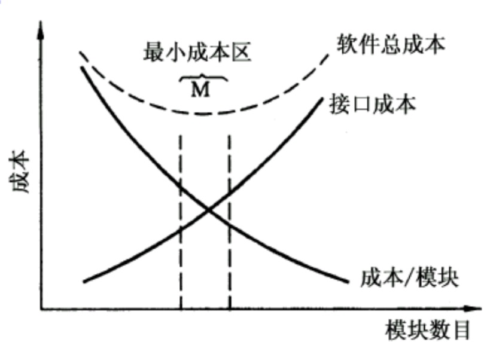

# 软件工程 复习提纲

---

wonyeaweat@foxmail.com, 24/12/2020.

---
[toc]

---

## 1 软件工程概论

### 1.1 什么是软件
软件是计算机系统中与硬件相互依存的另一部分，包括程序、数据及其相关文档的完整集合。其中程序是按事先设计的功能和性能要求执行的指令序列；数据是能使得程序能够正确的处理信息的数据结构；文档是与程序开发、维护和使用有关的图文材料。

### 1.2 软件包括哪些基本组成要素
软件是
（1）指令的集合（计算机程序），通过执行这些指令可以满足预期的特性、功能和性能需求。
（2）数据结构，使得程序可以合理利用信息。
（3）软件描述信息，它以硬拷贝和虚拟形式存在，用来描述程序的操作和使用。

> 上述也是黑书对于软件定义的描述。

### 1.3 什么是软件工程
我国2006年的国家标准GB/T 11457-2006《软件工程术语》对软件工程的定义为： “应用计算机科学理论和技术以及工程管理原则和方法，按预算和进度，实现满足用户要求的软件产品的定义、开发、发布和维护的工程或进行研究的学科。” 

> 黑书：IEEE93a标准：软件工程是将系统化的、规范的、可量化的方法应用于软件的开发、运行、维护，即将工程化方法应用于软件。同时也包括对上述方法的研究。

### 1.4 软件工程主要包括哪几个基本要素
方法，工具，过程。

> 黑书：工具，方法，过程，质量关注点（由高层到底层，由集成到基础）

## 2 软件过程
### 2.1 什么是软件过程
软件过程是工作产品构建时所执行的一系列活动、动作和任务的集合。

### 2.2 典型的软件过程模型有哪几种
软件过程模型即软件生存期模型。是从软件项目需求定义直至软件运行维护终止为止，跨越整个生命周期的系统开发、运行和维护的全部过程、活动和任务的结构框架。典型的包括瀑布模型、原型模型、增量模型、螺旋模型、统一过程、敏捷过程等。

## 3 里程碑
里程碑指可以用来标识项目进展状态的事件。如完成用户手册事件。管理人员用里程碑评价软件开发的进展情况。对于软件开发的管理非常重要。

## 4 数据字典
数据字典以词条方式定义在数据模型、功能模型和行为模型中出现的数据对象和控制信息的特性，给出它们的准确定义，包括数据流、加工、数据文件、数据元素，以及数据源点和汇点等。是将三种分析模型黏合在一起的粘合剂。是分析模型的中心。其精确地严格地定义了每一个与系统相关的数据元素，并以字典顺序将他们组织起来，使得用户和分析员对所有的输入、输出、存储成分和中间计算有共同的理解。

## 5 软件测试
### 5.1 黑盒测试与白盒测试
黑盒测试：已知产品的功能设计规格，可以通过测试证明每个实现了的功能是否符合要求。
白盒测试：已知产品的内部工作过程，可以通过测试证明每种内部操作是否符合设计规格需求，所有内部成分是否已经过检查。

### 5.2 主要的不同点
对于黑盒测试，意味着测试要根据软件的外部特性进行。将测试对象看作一个黑盒子，测试人员不考虑程序内部的逻辑结构和内部特性，仅依据程序的需求规格说明书，检查程序的功能是否符合功能说明。

对于白盒测试，是对软件的过程性细节做细致的检查。这是将测试对象看做一个打开的或透明的盒子，允许测试人员利用程序内部的逻辑结构以及相关信息，设计或选择测试用例，对程序所有的逻辑路径进行测试。通过在不同点检查程序的状态，确定实际的状态是否和预期的状态一致。因此白盒测试又称为结构测试或逻辑驱动测试。

## 6 结构化分析

### 6.1 结构化分析方法
结构化分析（方法）是一种具有代表性的传统分析建模方法。是一种面向数据流进行需求分析的方法，是一种建模技术。

### 6.2 包括的图与作用
结构化分析方法模型的核心是数据字典，包括在目标系统中使用和生成的所有数据对象。围绕这个核心的有三种图；
（1）数据流图（DFD）描述数据在在系统中如何被传送或变换，以及描述如何对数据流进行变换的功能（子功能），用于功能建模。
（2）实体-关系图（ER图）描述数据对象以及数据对象之间的关系，用于数据建模。
（3）状态-迁移图（STD）描述系统对外部事件如何响应。如何动作，用于行为建模。

## 7 面向对象分析

### 7.1 什么是面向对象分析OOA

面向对象分析（Object-Oriented Analysis）就是抽取和整理用户需求并建立问题域精确模型的过程，按找面向对象的思路分析用户需求。

### 7.2 有哪几种基本模型

面向对象分析模型由三种独立的模型构成。
（1）用例模型：由用例和场景表示的功能模型。
（2）对象模型：由类和对象表示的静态模型。
（3）交互模型：由状态图、顺序图等表示的动态模型。 

### 7.3 不同模型对应的UML图
（1）用例模型：用例图
（2）对象模型：类图
（3）动态模型：顺序图，通信图，状态图

## 8 结构化设计方法

### 8.1 模块化设计的基本原则
模块化设计是分而治之策略的具体表现。软件结构化设计的基本原则包括：分而治之、模块独立性、提高抽象层次、复用性设计、灵活性设计。

### 8.2 什么是分治原则
分治原则对应的是结构化设计中的分而治之原则。即将大型问题分解为容易分解的小问题，是常用的问题解决策略。

### 8.3 使用分治原则的注意事项
模块化设计是分而治之的具体表现，需要考虑模块数、模块大小与成本、工作量之间的平衡关系。

## 9 组装测试

### 9.1 什么是集成测试
组装测试也叫做集成测试或联合测试。即在单元测试额度基础上，将所有模块按设计要求组成为系统时进行的测试。在进行单元测试的同时可以同时进行组装测试，发现并排除模块连接中可能出现的问题，最终构成要求的软件系统。

### 9.2 集成有哪些基本方式
（1）一次性组装方式(big bang)：非增殖式组装方式，又称整体拼装。
（2）增殖式组装方式，又称渐增式组装，常见的包括衍变的的自顶向下的增殖测试、自底向上-自顶向下的增殖测试、回归测试等。

## 10 单元测试

### 10.1 什么是单元测试
单元测试又称模块测试，是针对软件设计的最小单位（程序模块）进行正确性检验的测试工作。目的在于发现各模块内部可能存在的各种差错。需要从程序的内部结构出发设计测试用例。多模块间可以平行独立进行单元测试。

### 10.2 单元测试有哪些基本方式
（1）模块接口测试：针对被测模块的数据流进行测试
（2）局部数据结构测试：测试是否存在基本的数据错误，如未初始化变量，错误拼写，不同步数据类型等问题。
（3）路径测试：对模块中重要的执行路径进行测试。
（4）错误处理测试：检测模块的错误预计与错误处理功能。
（5）边界测试：测试模块在边界问题上处理是否正确。

## 11 路径覆盖

### 11.1 什么是环路复杂度
环路复杂度用来定量度量程序的逻辑复杂度。以McCabe方法来表示。

### 11.2 环路复杂度在软件开发中的应用
主要运用于软件测试环节，是一种为程序逻辑复杂性提供定量测度的软件度量，也是对软件最终的可靠性给出某种预测。

### 11.3 如何计算环路复杂度
在程序控制流程图中，节点是程序中代码的最小单元，边代表节点间的程序流。一个有e条边和n个节点的流程图F，可以用下述3种方法中的任何一种来计算环形复杂度。

（1）流图中的区域数等于环形复杂度。
（2）流图G的环形复杂度V(G)=E-N+2，其中，E是流图中边的条数，N是结点数。
（3）流图G的环形复杂度V(G)=P+1，其中，P是流图中判定结点的数目。

### 11.4 什么是独立路径
独立路径是指包括一组以前没有处理的语句或条件的一条路径。
换言之，即在程序控制流程图中，从程序的入口到出口的多次执行中，每次至少有一个语句是新的，未被重复的，也即每次至少要经历一条从未走过的弧。

### 11.5 如何求独立路径
独立路径数的上界即该图的环形复杂度。

## 12 软件体系结构

### 12.1 什么是软件体系结构
（1）软件体系结构是具有一定形式的结构化元素，即构件的集合，包括处理构件、数据构件和连接构件。处理构件负责对数据进行加工，数据构件是被加工的信息，连接构件把体系结构的不同部分组合连接起来。
（2）一个程序或计算机系统的软件体系结构是指系统的一个或者多个结构。结构中包括软件的构件、构件的外部可见属性以及它们之间的相互关系。外部可见属性则是指软件构件提供的服务、性能、使用特性、错误处理、共享资源使用等。

### 12.2 典型的软件体系结构，特点与应用场景
（1）数据流风格：当输入数据经过一系列的计算和操作构件的变换形成输出数据时，可以应用这种体系结构。
（2）调用/返回风格：便于设计出易于修改和扩展的程序结构。
（3）仓库风格：在这种风格中，数据仓库位于这种体系结构的中心，其中构件会经常访问数据仓库，并对仓库中的数据进行增加、修改或删除操作。

## 13 UML

### 13.1 什么是UML

UML：Unified Modeling Langauage,统一建模语言

### 13.2 动态模型包括哪几种图
动态图：状态图，顺序图，活动图，协作图

### 13.3 静态模型包括哪几种图
静态图：类图，对象图，用例图，部署图，构件图

## 14 原型法

### 14.1 快速原型法的应用目的

快速原型是快速建立起来的可以在计算机上运行的程序，它所能完成的功能往往是最终产品的一个子集。

### 14.2 原型法包括哪几种类型
试验原型法和演进原型法

## 15 需求规格说明书
主要包括软件需求规格说明（SRS）和数据需求说明（DRD）等，见黄书P60.

## 16 面向对象的典型特征
对象、类与封装、继承、多态、消息通信

## 17 软件测试

### 17.1 基本步骤
一般认为软件测试过程分四个步骤：单元测试、组装测试、确认测试、系统测试。

### 17.2 步骤的测试目标
（1）单元测试：集中对源代码实现的每一个程序单元进行测试，检查各个程序模块是否正确地实现了规定的功能。
（2）组装测试：将已测试过的模块组装起来，进行组装测试，对与设计相关的软件体系结构的构造进行测试。
（3）确认测试：检查以实现的软件是否满足了需求规格说明中确定了的各种需求，以及软件配置是否完全、正确。
（4）系统测试：把已经确认的软件纳入实际运行环境中，与系统其它成分组合在一起进行测试。严格来说，该部分已经不属于软件工程范畴。

### 17.3 什么是V模型
瀑布模型的一个实体，成为V模型，V模型描述了测试阶段的活动与开发阶段相关活动（包括需求建模、概要设计、详细设计、编码）之间的关系。

## 18 软件危机
### 18.1 什么是软件危机
软件危机：由于软件本身的特点及软件开发方法等多方面问题，软件的发展速度远远滞后于硬件的发展速度，不能满足社会日益增长的软件需求。

### 18.2 软件危机的主要表现
（1）缺乏软件开发的经验和有关软件开发数据的积累，使得开发工作的计划很难指定。
（2）软件开发人员与用户的交流存在障碍，除了只是背景的差异，缺少合适的交流方法及需求描述工具也是一个重要原因，这使得获取的需求不充分或存在错误，存在的问题在开发初期难以发现，往往在开发后期才暴露出来，使得开发周期延长，软件难以维护。
（3）软件开发过程不规范，缺乏方法论和规范的指导，开发人员各自为战，缺少整体的规划和配合，不重视文字资料工作，软件难以维护。
（4）随着软件规模的增大，使复杂性往往会呈指数级升高。
（5）缺少有效的软件测评手段，提交用户的软件质量差，在运行中暴露出大量的问题。

## 19 瀑布模型

### 19.1 什么是瀑布模型
传统软件工程方法学的软件过程基本上都可以按瀑布模型叙述。

### 19.2 瀑布模型的缺陷与原因
由于瀑布模型几乎依赖于书面的规格说明，很可能导致最终开发出的软件产品不能真正满足用户的需要。如果需求规格说明与用户需求之间有差异，就会发生这种情况。因此瀑布模型只适用于项目开始时需求已确定的情况。

## 20 UML主要视图与应用阶段
用例图：用于需求分析阶段。
类图：模型的静态结构也称为状态结构。
顺序图：描述对象之间的动态交互关系。
通信图：是顺序图的一种变化形式，用于描述相互写作的对象间的交互关系和链接关系。
状态图：描述一个特定对象的所有可能的状态以及引起状态转换的事件。
活动图：用来捕捉用例的活动，用框图的方式显示动作以及结果。
构件图：描述软件构件及构件之间的依赖关系，显示代码的静态结构。
部署图：描述处理器、设备和连接，它显示系统硬件的物理拓扑结构及在此结构上执行的软件。

## 21 软件生存周期阶段
（1）软件定义：主要任务是解决“做什么”的问题。该时期的工作也就是常说的系统分析，由系统分析员完成。它通常又分为三个阶段：问题定义、可行性研究和需求分析。
（2）软件开发：主要任务是解决“如何做”的问题，即具体设计和实现在前一个时期定义的软件。它通常由概要设计、详细设计、编码和测试四个阶段组成。
（3）运行维护：主要任务是使软件持久第满足用户的需要。通常有四类维护活动：改正性维护；适应性维护；完善性维护。

## 22 软件产品质量模型

### 22.1 软件产品质量模型中的指标

> 【黑书P135】FURPS属性指标，分别代表功能性（functionality），易用性（usability），可靠性（reliability），性能（performance），可支持性（supportability）。

### 22.2 各个指标的基本含义
> 【黑书P135】
> 功能性：评估程序的特征集和能力，所提交功能的通用性以及整个系统的安全性。
> 易用性：考虑人员因素，整体美感，一致性，文档来评估。
> 可靠性：测量故障的频率和严重性，输出结果的精确性，平均故障时间，故障恢复能力和程序的可预见性。
> 性能：处理速度，响应时间，资源消耗，吞吐量，效率。
> 可支持性：综合可拓展性，可适应性和可用性。更通用的是可维护性。还包括可测试性，兼容性，可配置性，系统安装简易性，问题定位容易性。

## 23 接口与抽象类

### 23.1 上述二者之间的相同点和不同点

接口是不可直接实例化的特性集合的声明，即其对象不能直接实例化，需要通过类来实现。实现接口的类需要实现接口中声明的方法。

抽象类是至少包含一个没有实现方法的类。如果在一个抽象类中所有的方法都没有实现，则称为纯抽象类。接口和纯抽象类似乎没有区别，但实际上，接口和抽象类还有本质上的区别。在只支持单继承的语言中，一个类只能有一个直接父类，但是却可以实现多个接口。

### 23.2 如何在实践中理解和应用

成功使用接口可以降低代码中的依赖性，使用接口编程，客户对象不需要知道所使用对象的类详细说明和这些接口的实现细节。要使得软件可复用，可维护可扩展，面向对象设计的一条最重要的原则是：面向接口编程，而非面向实现编程。

## 24 需求分析

### 24.1 需求分析的基本任务
软件需求分析阶段分四个步骤：需求获取，需求分析，需求定义，需求验证。
需求获取：发现分析问题，与用户进行交流，按照数据-过程-接口观察问题的不同侧面，将需求文档化。
需求分析：考虑需求的完整性，正确性，合理性，可行性，充分性。
需求定义：将已经分析的需求全面系统生成正式文档。
需求验证：对已定义的需求进行评审，且需要有用户参加，析取意见，改善完善。

### 24.2 主要面临的问题与解决方法
系统的目标或范围问题;需求不准确性问题;需求的易变问题;

### 24.3 针对这些问题采用哪些解决方法
需求分析除了需要有专业的系统分析师，还要客户与开发者的合作。提出需求后，仍需要进一步推敲细化和扩充。要遵循深入浅出的原则与以流程为主线的原则。尽可能全面细致，将内容串联起来，便于沟通交流。

---

---