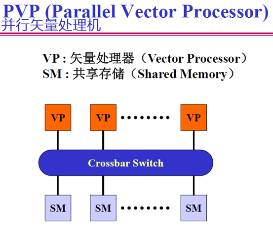
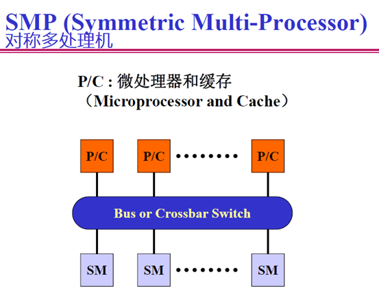

# 高性能与云计算 复习

---

wonyeaweat@foxmail.com , 2/1/2021

---

## 1.基本概念
###  PVP, SMP, MPP, DSM, Cluster

###  UMA, NUMA, CC_NUMA, CORMA, NORMA

### HPC, HPCC, Distributed computing, Cloud computing
## 2.熟悉掌握PVP、SMP、MPP、DSM 和Cluster 并行机结构的不同点。
3. 列出常用静态网络和动态网络的主要参数（节点度、直径、对剖带宽和链路数）以及复
杂度、网络性能、扩展性和容错性等。
4. 掌握并行计算模型PRAM、BSP 和logP，以及PRAM-CRCW 等PRAM 存取模式。
5. 掌握加速比（speed up）、并行效率（efficiency）和可扩展性（scalability）。如何描述
在不同约束下的加速比？掌握加速比性能定理。
6. 如何进行并行计算机性能评测？什么是基准测试程序？
7. 什么是分治策略的基本思想？举例说明如何应用平衡树方法、倍增技术和流水线技术。
8. 掌握均匀划分、方根划分、对数划分和功能划分等。如何用划分方法解决PSRS 排序、
归并排序和（m,n）选择问题？
9. 并行算法设计的一般过程PCAM 是指什么？各个步骤中的主要判据是什么？
10. 理解算法6.2（并行快排序），7.1（PSRS 排序算法），7.8（求最大值算法），7.9（求前
缀和算法）。
11. 掌握并行矩阵乘法的基本方法，掌握简单分块并行算法、9.5（Cannon 算法），9.6（DNS
算法）的基本原理和算法过程。
12. 掌握进程通信的同步方式和聚集方式。列举主要的通信模式。
13. 理解共享存储编程模型和分布存储编程模型的特征及差异。
14. 什么是OpenMP 的编程模型、体系结构、控制结构和数据域子句？
15. 什么是MPI 的消息、数据类型、通信域？
16. 什么是MPI 的阻塞通信和非阻塞通信？点到点通信模式有哪些？MPI 群集通信模式？
17. 熟悉掌握用OpenMP 和MPI 编写计算圆周率Pi、计算内积等简单例程和代码；熟悉掌
握OpenMP 的基本编程方法和不同的并行化控制方法。
18. 掌握Map/Reduce 的体系结构和工作原理，理解Word Count 算法的Map/Reduce 算法原
理，负载均衡和容错方法；掌握GFS 的系统结构、特点和数据修改等流程，容错方法。
19. 理解GPU 结构和CUDA 编程的基本概念。
20. CUDA 和Map/Reduce 不要求具体代码编写。
21. 掌握课后习题、作业和课堂练习题。
22. 题型：单项选择，简答，综合。